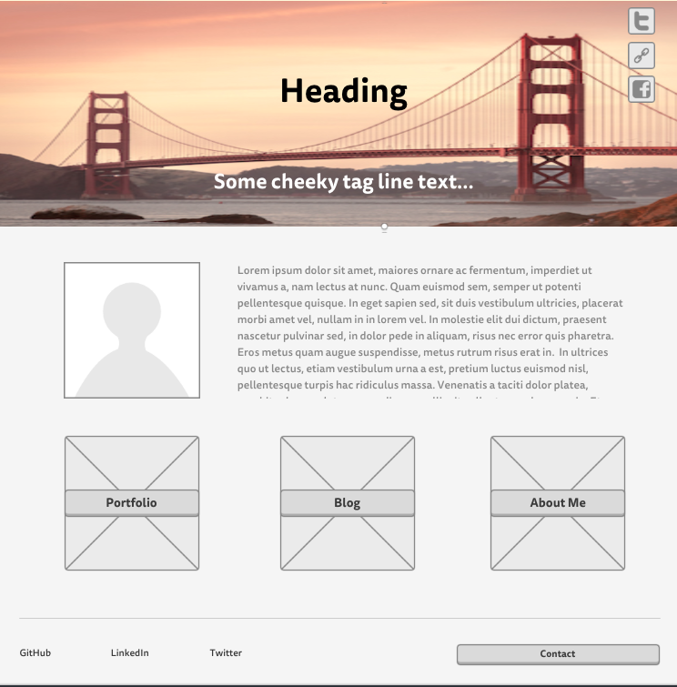
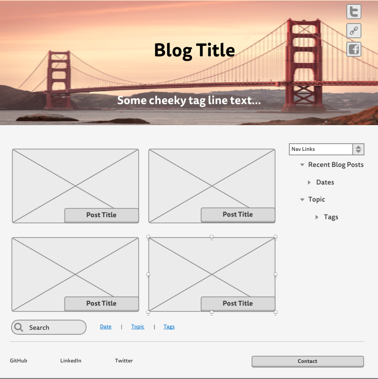

This week we learned about wireframing. A wireframe is a simple blueprint for the layout of a website. Before you start coding it’s good to draw up a wireframe so you have an idea of what elements will be on each page and what order they will be in etc. It also gives you an idea of how the site will look and function so you can quickly test design ideas and get a feel for if your site flows well and gives a good user experience. I enjoyed wireframing my site but I can see myself getting too detailed and nit picky so remembering to time box is pretty important for me in this stage of designing. I made my initial wireframe and then did some poking around the Internet for design ideas and came back to revise my wireframes. I typically prefer to draw out my wireframes and then fine-tune them in Photoshop or Illustrator so for this challenged I decided to step out of my comfort zone and check out the free wireframe resources that were suggested. I used Mockingbird to make my wireframes and I really enjoyed it. It was very easy to figure out and had all the elements I needed ready to drag and drop in. The snap feature was really great to help line elements up and make my OCD happy. It also saves my wireframes for a week so it was easy to go back later and revise them. 