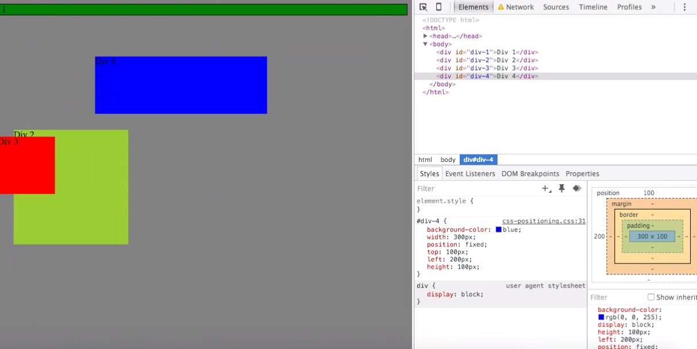

* How can you use Chrome's DevTools inspector to help you format or position elements?
You can easily change CSS elements in Chrome's DevTools without altering your files and see the changes in real time. This is handy if you want to easily experiment with your format or design without permanently changing your files.

* How can you resize elements on the DOM using CSS?
You can adjust the height and width properties to resize elements. If you use pixels your element will be a fixed size. If you use ems or percentages your element will be responsive to the size of the viewport/window. 

* What are the differences between absolute, fixed, static, and relative positioning? Which did you find easiest to use? Which was most difficult?
Static – objects show up as they are laid out in the HTML and are not affected by any top, bottom, left or right properties. This is the default positioning
Relative – object can be adjusted using top, bottom, left and right. These values move the object relative to the objects original position.
Fixed - object can be adjusted using top, bottom, left and right. These values move the object relative to the viewport and the object remains in place regardless of scrolling. 
Absolute - object can be adjusted using top, bottom, left and right. These values move the object relative to the parent object as long as that object has a position that’s not static.

Static and fixed I was able to grasp, but relative and absolute are much more difficult. I needed to do a lot of extra research to figure these out and I still feel really 
iffy about them. 

* What are the differences between margin, border, and padding?
The border is the stroke around your object. The padding is the space between the border and any element inside of your object. The margin is the space between the border and any element outside of your object.

* What was your impression of this challenge overall? (love, hate, and why?)
It was nice to have a challenge focused solely on positioning because I really need extra help with it. When I read the challenge I was really apprehensive about it but with the help of my pair it wasn’t as difficult as I thought it would be.
